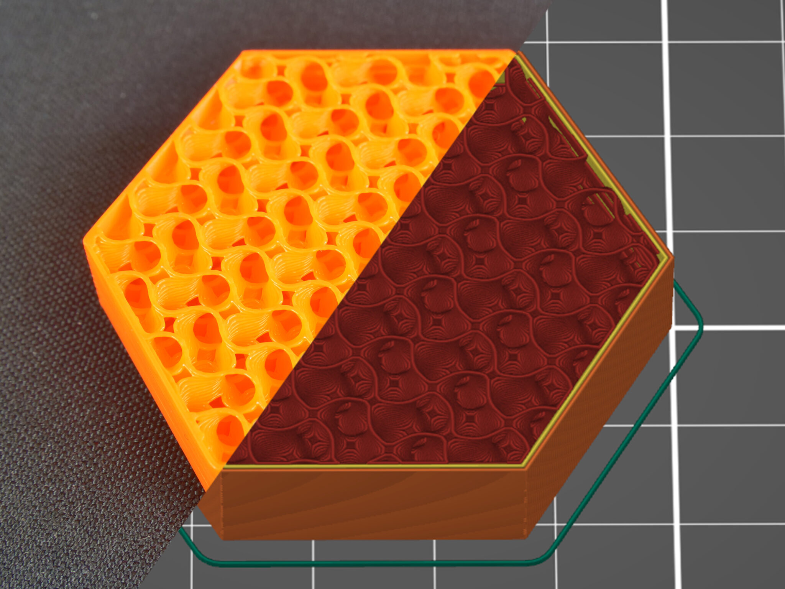
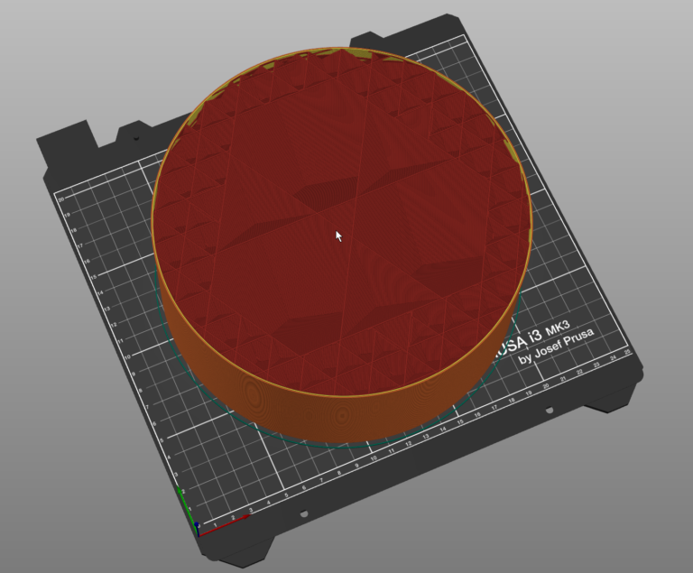
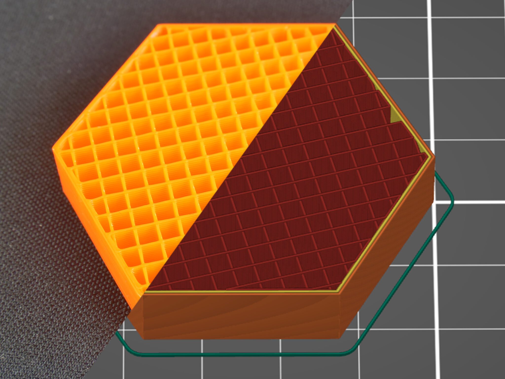

# L03 – Design Something Small

## Objective

- Design a small object on a parametric CAD system.
- Research three infills to describe what the uses are for each, besides the ones presented in class.
- Use PrusaSlicer to change the default infill percentage, infill pattern, and wall thickness.
- 3D print your design using one of the FDM printers from the UNCC print farm.
- In your documentation, directly answer these three questions from the live demo:
  - How does percentage infill affect mechanical properties?
  - How do different infill patterns affect mechanical properties?
  - Why use different wall thicknesses?

## Design

For some reason when we were tasked with designing a small part to be printed, my mind went to a snow man. I started by selecting a plane and drawing a circle, split it in half, then revolved it around the central axis to make a sphere. I repeated this step with smaller circles and offset planes two more times to make a 3 ball snowman. I then created another plane a few mm from the "face" of the top ball. I couldn't get the wrap feature to work on a sphere as I have before on a cylinder so I just negative extruded straight back from the plane to make the eyes and nose hole. I was going to add a carrot nose straight on however I grew questionably curious about the possibility of screwing in the nose and how small threads could be. Because of this I made a screw in nose which I was hesitant would work come time to print but curious enough to try it.

  
  

## Research

Infill 1: gyroid

Gyroid infill is my favorite infill for most prints. It's a particularly good choice a lot of the time because it has nearly equal strength in all directions. This is helpful when you don't know where loads are going to be coming from, which is often the case with anything from toys to freestanding components like end effectors. Gyroid infills also have one of the highest strength to weight ratios of any common infill pattern and allows one to fill it with resin increasing strength and density further.

Infill 2: Adaptive cubic infill

Adaptive cubic infill uses the same principals as cubic infill, it starts from the center with corner down cubes. Where it differs from standard cubic infill is around the edges where a full size cube won't fit. When the geometry of the part wont allow for a full size cube, smaller, more densely packed cubes are put in the place. Having this "higher" infill around the edge has a lot of benefits. It allows for a lighter weight part with nearly the same strength. Prints with adaptive cubic infill often use 15 percent less infill material than a similar part with rectilinear infill.

Infill 3: Rectilinear

rectilinear infill is the standard for high infill prints. It switches the direction of printing layer to layer preventing buildup where the paths cross. It is not fancy or the best at any particular category but it gets the job done for almost anything where requirements aren't strict and the goal is a functional quick print.

## Preprocessor and Printing

Once the part was made, I moved my part, as well as Juan's, over to Prusa Slicer and started changing settings. The first thing I did was set the layer height to .1 mm on FAST DETAIL mode. I did this in order to increase the chances that the nose threads translate cleanly. We set the filament to PETG next as printer 2 that we were using was already set up with it in the extruder. We kept infill percentage relatively low at 25 percent however we changed the infill type to gyroid as our parts had different objectives and gyroids ability to support along multiple axis helped ease our nerves about those differences. We also bumped the wall count from 2 to 3 to add a little bit more strength to the fins in Juan's card holder and in turn also making the snow man a little bit stronger. We had the option to make different print settings for each part however we decided that having a consistent print would be more valuable than using perfectly ideal settings for each individual one. The last setting we changed was adding brims. By adding these brims, we were able to get stronger bed adhesion for every part but it was especially important for the nose of the snow man as it was supper skinny with poor bed contact area. 

  
  
  
  

## Print

We exported our g-code to the thumb drive for printer 2, plugged it in, and started the print. During class time we waited for the bed to heat up and the heat to distribute evenly then saw a solid first layer. Once this was seen and good, I went to get some food while the rest of the hour twenty print finished. When I returned the parts were nearly complete. All parts finished in decent quality however as I suspected the threads we're too tight of a fit to work. The error along the x-y axis was too great for the nose to fit into the hole meant for it. I still had a good quality snowman at the end of the day but it looked like a deer had stopped by and got it's nose. 

## Lessons Learned

I learned that I should do more research into 3d printing fine details like threads as there are limitations I haven't quite figured out yet. I have gotten M2.5 threads before for a prototype but these were more like 1.8 mm which was too ambitious. I also refreshed my memory on infill types and their ideal applications. I had been using gyroid a lot to the extent that I honestly forgot why so it was nice to do some reading into it.

## Resources

Prusa infill patterns: https://help.prusa3d.com/article/infill-patterns_177130
