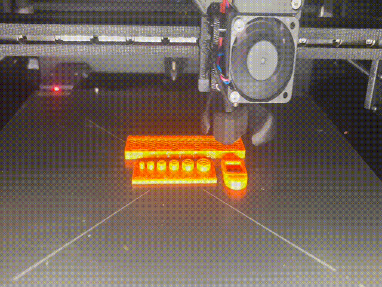
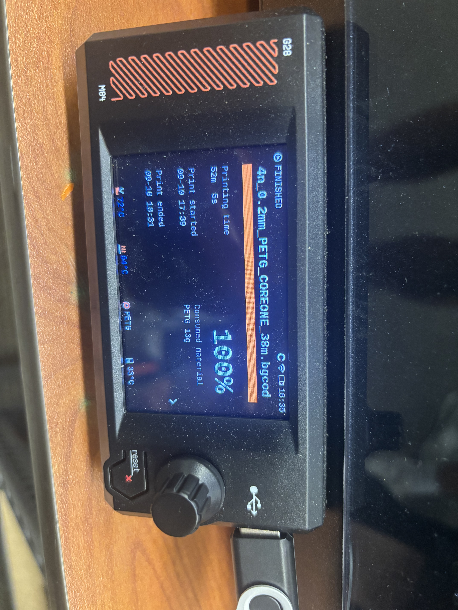
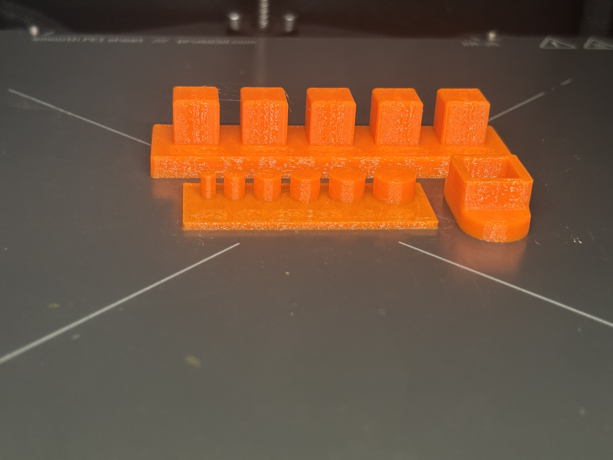

# A4 – Benchmark a Parameter

## Objective

"For this week you have an opportunity to design a benchmark artifact to test the limits of the Prusa Core One. After which you have a better understanding of what can be feasibly 3D printed on the Prusa Core One. This knowledge increases your engineering prowess among your peers.

Every manufacturing process has physical limits: minimum wall thickness, maximum unsupported overhang angle, achievable tolerance, minimum hole diameter. This is why design rules exist for each process. FDM, SLA, SLS, and metal printing each have different limits, and a design rule that works for one process can fail on another. This week you will discover the Prusa Core One's actual limits firsthand, then compare what you found to the documented FDM design rules.

Although this is the first time your design does not have geometric limits, be cognizant of time on the machine. We are limited on machines, therefore time on machine is precious to all students. Print time may not exceed one hour per artifact. Lab access is available 24 hours a day."

## Document

The parameter I decided to test was the tolerance of extruded members. I made a part very similar to the tolerance gauge test that was shown in the examples. I have calipers in inches so I made the posts .125 in, .175 in, .225 in, .25 in, .3 in, and .35 inches. I kept two walls and made the infill a gyroid pattern, although strength matters very little for this part. I think tolerances will be within a thousandth of an inch, the layer width is .45 mm or 0.0177 in and it has some control over where the center of that lands. There are small amounts of error from the linear actuator and stepper motor as well as from bending of the chassis but it's all minimal. Shrinkage of material is also something to note, as the filament cools it doesn't maintain the same dimensions, I would assume this is factored into the slice but I can not say that with certainty.

## Preprocessor

  
  

When slicing it, I went with 3 walls, 25 percent gyroid infill, and .2 layer height at "balanced" speed. I tried to leave the settings in a state that would be typical when making this part to give a good baseline for future prints. The gyroid infill is the strongest when you don't know what forces an object will be introduced to and 25 percent is low but plenty when the infill is only covering a few millimeters of height. I did three walls to make sure the outermost one had good support and my calipers weren't going to push them in and give a poor reading. The .2 layer height at medium speed allowed for a quick print with dimensions I am looking at being stable still. The parts also had flat bottoms which allowed us to not use supports and have a predefined print orientation. Along these same lines of designing with a 3d print in mind, we made sure the scale was correct when exporting and thus didn't need to rescale in the slicer.

## Results

  
  
  
  

Once printed, the part was ready to test. The nubs measured as follows:

- .35 in measured as .341 in
- .3 in measured as .290 in
- .25 in measured as .242 in
- .225 in measured as .216 in
- .175 in measured as .165 in
- .125 in measured as .115 in

the error was consistent across the range at .011 to .009 in of error. I want to say this is due to shrinkage as the part cools but I am unsure as the bigger nubs would have shrunk the same amount as the smaller nubs. Regardless, for PETG, you can assume this printer will have a outer diameter error of around .010 inches. looking at the Source: <a href="https://after-support.flashforge.jp/uploads/datasheet/tds/PETG_TDS_EN.pdf">PETG Datasheet</a>, you can see there is minimal information about dimensional accuracy but it does say PETG is has stable dimensions which makes me think filaments that are harder to print with will have more issues and error will be harder to fully and predictably account for. From what I read in a Protolabs article, higher temperature filaments are at higher risk of warping, "Thermoplastics that require a higher print temperature are more at risk. Adding a radius on the bottom edge in contact with the build plate or a brim is recommended. Shrinkage usually occurs in the 0.2 - 1% range depending on the material." FDM is also one of the least accurate of 3d printing techniques with many resin printers being able to achieve finer details (lasers and LEDs are a lot easier to position than an extruder).

## Lessons Learned

The printer was not quite as accurate as I was expecting however it is within a hundredth of an inch or a quarter of a millimeter. I also learned that error is consistent, but present. This means it can be designed around to achieve an error of +- .001 in from my testing. Knowing typical dimensional accuracy issues per the filament before designing would help you achieve much tighter tolerances and I would be able to get better performing systems when multiple pieces are coming together. 

## Sources

Source: <a href="https://after-support.flashforge.jp/uploads/datasheet/tds/PETG_TDS_EN.pdf">PETG Datasheet</a>
Source: <a href="https://www.hubs.com/knowledge-base/dimensional-accuracy-3d-printed-parts/">Protolabs 3D Print Dimensional Accuracy</a>
