# L06 – Snap Fit Raspberry Pi Case

## Objective

- In order to design a mated part, take measurements of an artifact's feature you wish to mate your design.
- Parametrically design something small that snap fits (fits that cannot be pulled apart easily) into one of the features of the artifact measured in class.
- Use parameters in CAD
- Use constraints in CAD
- Test your design, if it does not fit properly redo

Download: <a href="https://cad.onshape.com/documents/e167fbfaca504816960d2427/w/b75c977a15761a78746e9e51/e/600384a6ece85681925c01f4">Onshape</a> | <a href="Case.step">Case.step</a> | <a href="Case.stl">Case.stl</a>

## Measuring

  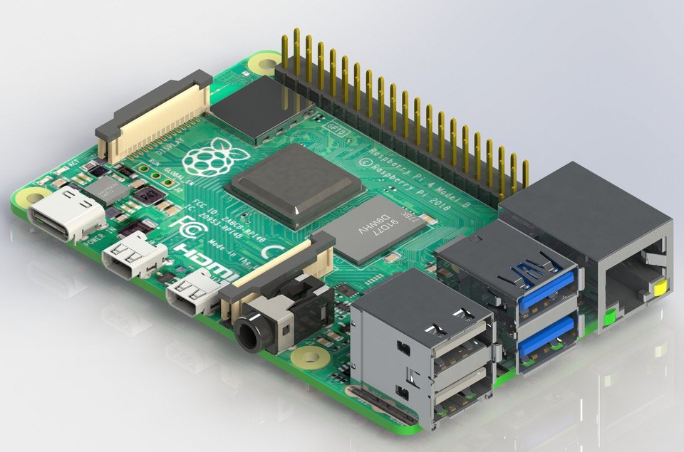
  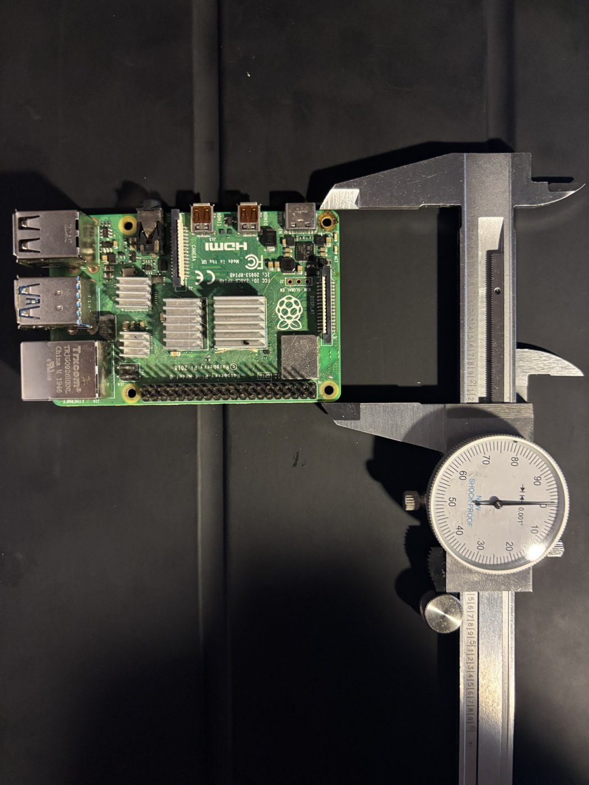
  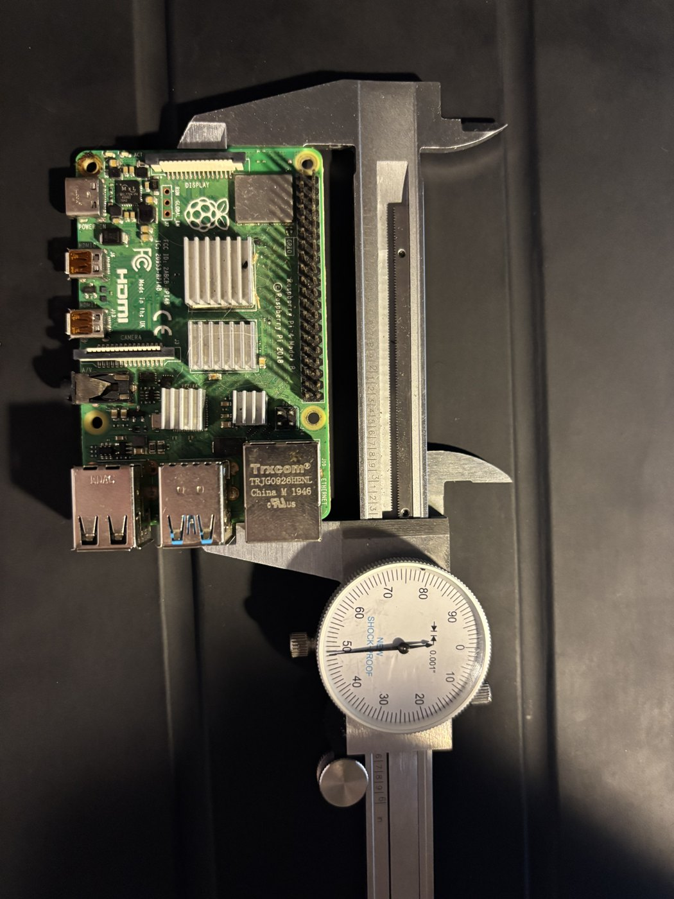
  

I wanted to make a case for my raspberry pi 4b so pins wouldn't get bent while it's not in use. I measured my pi with inch calipers however figured I could find more accurate and usable measurements in mm with a CAD file so I got one from <a href="https://grabcad.com/library/raspberry-pi-4-model-b-1">grabCAD</a>. The board measured 3.346 by 2.205 in (85 by 56 mm) which matched the model, so I used the model for the port locations. The features I mated to are the board edge and the USB/ethernet stack.

## Design

  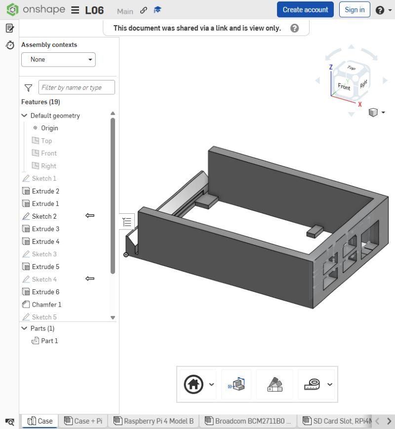
  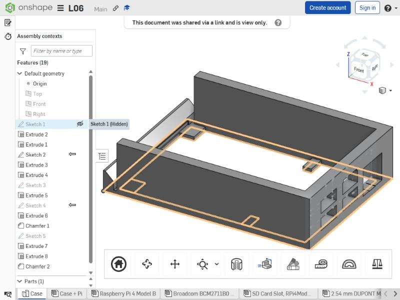
  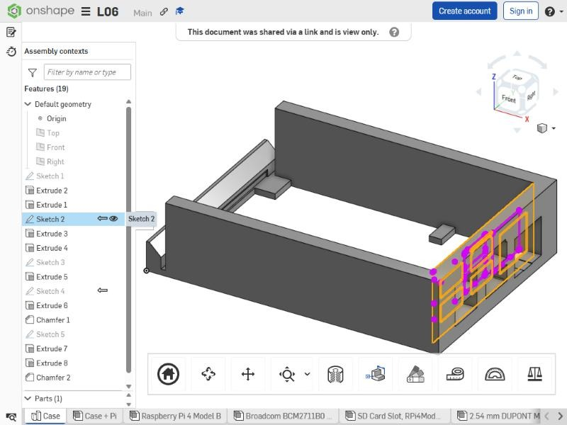
  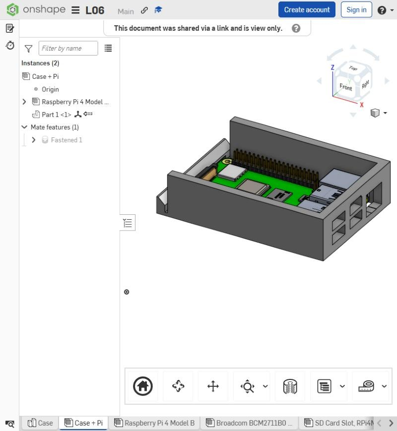

I made it in Onshape just using sketches, extrusions, and some chamfers. Sketch 1 is a 100 by 70 rectangle for the overall case dimensions. I offset by 5 mm for the walls with four pads in the corners where the mounting holes are. I only used threee dimensions in it, the rest is constraints so the cavity follows the wall thickness. I put the pi in an assembly with the case and projected the port faces and the board edge straight off the model for Sketch 2 and Sketch 4, so the openings and the groove are exactly where the board is.

  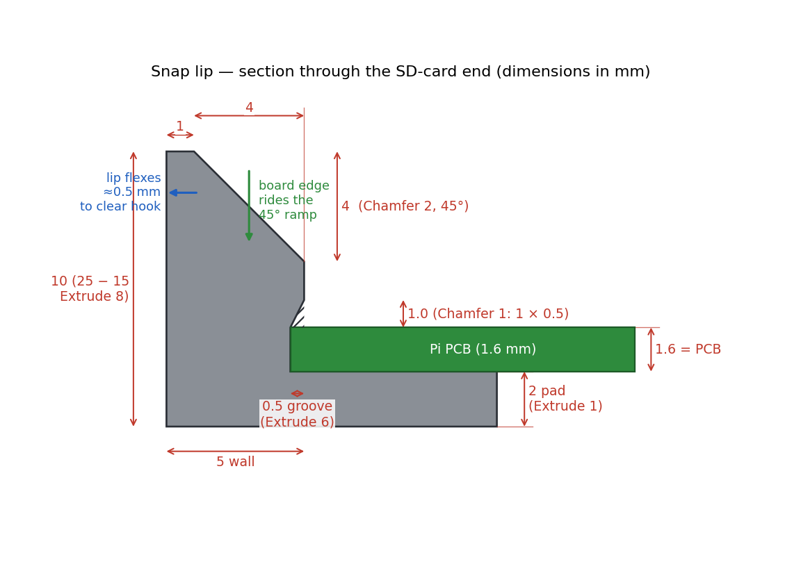
  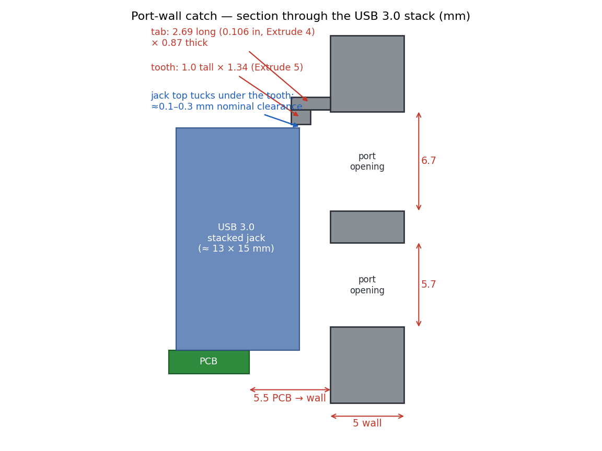
  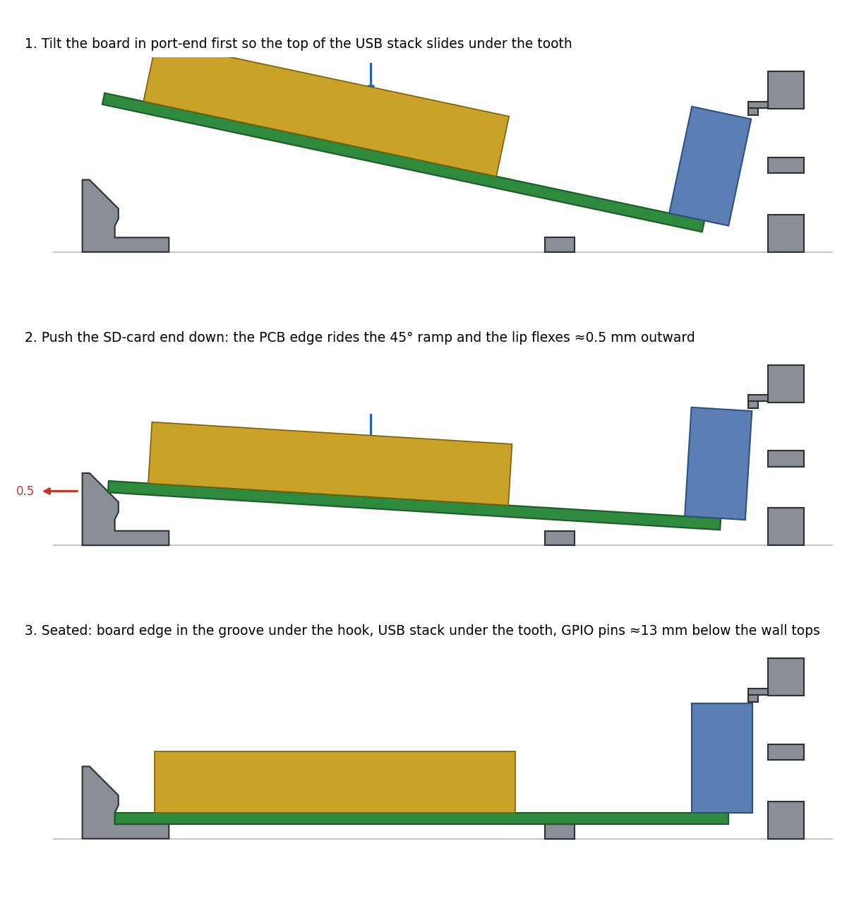

The snap is on the SD card end. The board edge drops into a .5 mm groove with a chamfered hook over it, the end wall is cut down to 10 mm with a 45 degree lead in so the board can tilt in, and 1.5 mm relief slots at the corners let the lip flex out to let the board past. On the port end a small tab with a 1 mm tooth sits over the USB 3.0 housing and just keeps that end from lifting, it doesn't locate the board sideways. Board goes in port end first, then the SD end pushes down and snaps in.

| Feature | Parameter | Value | Why |
|---|---|---|---|
| Sketch 1 | Length × width | 100 × 70 mm | 85 × 56 board + 5 mm walls + jacks + ~2 mm clearance per side |
| Sketch 1 | Wall thickness | 5 mm | Room for the port openings and the lead in |
| Extrude 2 | Wall height | 25 mm | 6 mm over the USB stack, pins recessed |
| Extrude 1 | Pad height | 2 mm | Lifts the SD slot off the floor |
| Extrude 4 / 5 | Catch reach / tooth | 0.106 in / 1 mm | Measured to get over the USB housing |
| Extrude 6 | Groove depth | .5 mm | Hook engagement, small enough to snap over |
| Chamfer 1 | Hook chamfer | 1 × .5 mm | Angled hook face |
| Extrude 7 | Relief slots | 1.5 mm | Lets the lip flex |
| Extrude 8 | Lip cut down | 25 → 10 mm | Board can tilt in over it |
| Chamfer 2 | Lead in | 4 × 4 mm, 45° | Pushes the lip out instead of landing on it |

Two values changed while modeling: the SD end wall started at 25 mm and got cut to 10 once I realized the board couldn't get over it, and the groove got an extra 1 mm of height plus the chamfer so the board could enter at an angle.

Allowances: 2 mm per side to the walls since they don't locate the board (L04 showed about .25 mm of printer error). The groove is board thickness at the back and opens up above it, so a tight print rides the ramp instead of jamming. .5 mm of hook is small on purpose because a 5 mm lip is stiff. The tooth sits .1 to .3 mm over the USB housing, a vertical gap so the error is about one layer. I found that the 100 mm overall was just a touch too large, reprinted with the dimension at 98.7 mm and it was still a touch too loose so I did a final print at 98.5 mm giving no tolerance so it is a secure fit.

  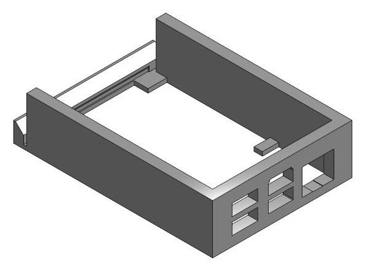
  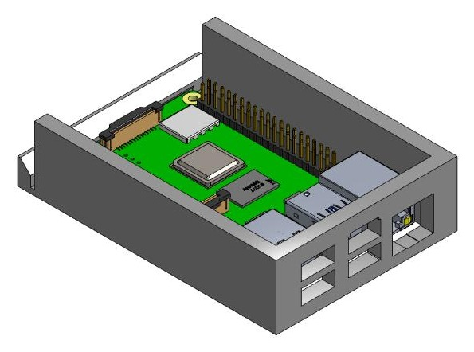
  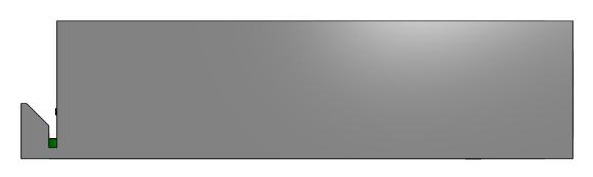

Exported from Onshape as an STL in mm. 100 by 70 by 25 mm.

## Preprocessor

  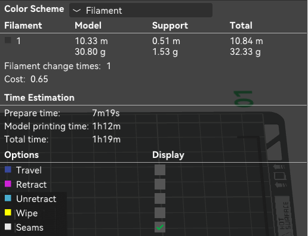
  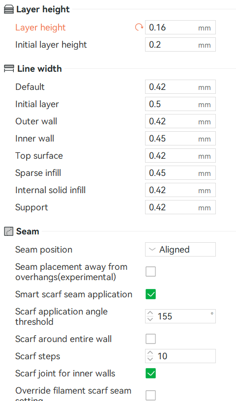
  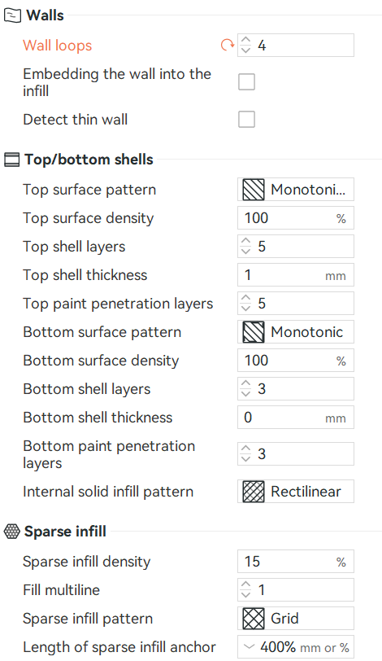
  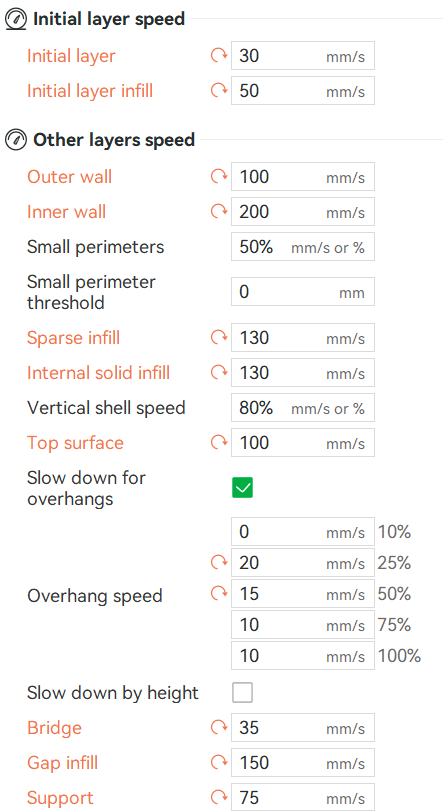
  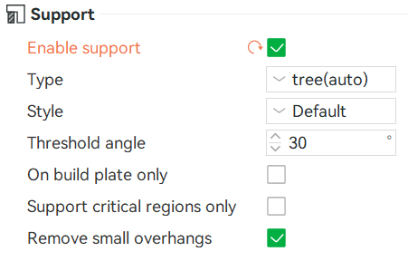

I printed at home on my Bambu Lab P1S since the bigger project this is part of will print at home as well and I want tolerances to be consistent. Open side up with the frame on the plate, the biggest flat surface, so all the walls print as vertical perimeters. Tree supports (auto, 30 degree threshold) only for the tops of the port openings and under the catch tab.

- .16 mm layers, .2 mm first layer, 156 layers total. The hook is .5 mm and the tooth is 1 mm so I wanted enough layers to draw them.
- 4 walls at .42/.45 mm line width, about 3.5 mm of the 5 mm wall is solid perimeter and the thin features are all perimeter. Walls are worth more than infill for strength.
- 15 percent grid infill, there's barely support after 4 walls.
- About 50 percent speed (100 outer wall, 200 inner, 35 bridge) for the bridges over the ports and the tooth.
- .4 mm nozzle.

32.33 g of filament (1.53 g of that support), 1 hour 19 minute print at my lower speeds.

## Print

<video
  src="print_timelapse.mp4"
  poster="IMG_print_1.jpg"
  controls muted loop playsinline
  preload="metadata"
  width="960">
  Your browser doesn't support HTML5 video.
</video>

I was not super impressed with the print quality, I had a partial clog in my nozzle which left some to be desired in the density. I printed again at the school on the Prusa to avoid this and it turned out much better.

## Fit

the first attempt was far too loose, the center of the board wasn't the center of the mounting because the ports are offset and my first iteration didn't account for this. My second print was slightly loose as well but much better. I tried to give .2 mm of tolerance for the snap fit so .3 mm of the .5 mm clip were used however this was a bit off still. For the third print I cut it down to an exact size and it fit much better.

## Lessons Learned

Projecting the ports and board edge off the pi model meant everything landed in the right spot first try, but the openings are jack size and not plug size, so for the bigger project they need clearance for the plug body. The 5 mm lip is also stiffer than I expected even with the slots seperating it from the other walls., next time I'd thin it out above the groove.

## Sources

Source: <a href="https://datasheets.raspberrypi.com/rpi4/raspberry-pi-4-mechanical-drawing.pdf">Raspberry Pi 4 Model B mechanical drawing</a>

Source: <a href="https://grabcad.com/library/raspberry-pi-4-model-b-1">Raspberry Pi 4 Model B on GrabCAD</a>

Source: <a href="https://us.store.bambulab.com/products/p1s">Bambu Lab P1S specifications</a>
